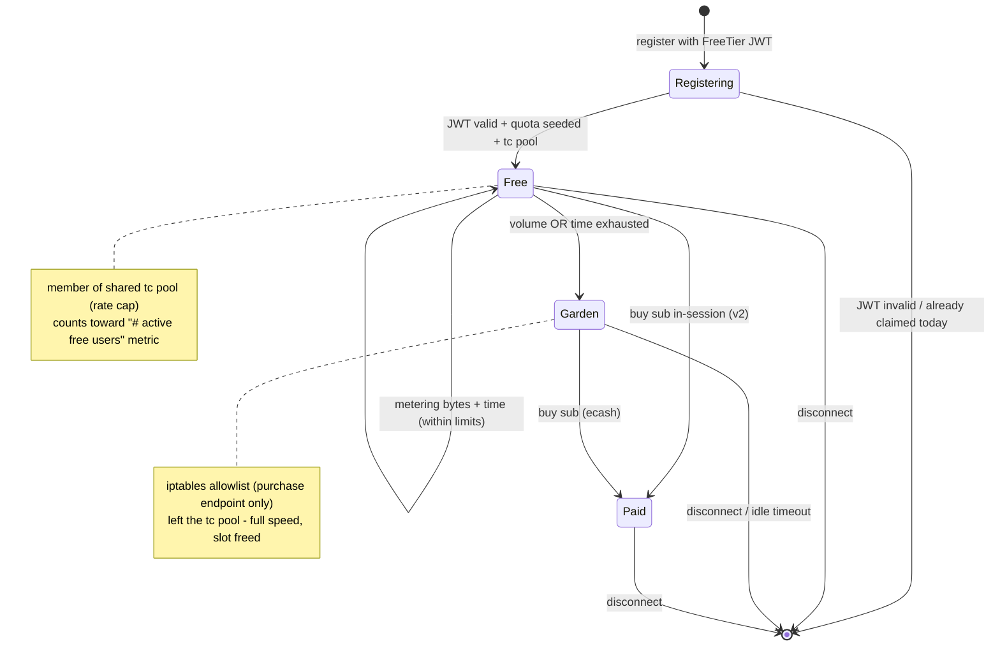

## Context

A WireGuard client reaches a Nym gateway by presenting a `BandwidthClaim` at registration; the gateway verifies it in `handle_final_credential_claim` and seeds a per-client bandwidth balance. That claim is a `BandwidthCredential` enum that already has two arms: `ZkNym` (paid ecash, verified against nym-api ecash keys) and `UpgradeModeJWT` (a credential-proxy-signed JWT verified locally with no chain or nym-api dependency). Bandwidth is metered per client in `common/credential-verification` (`try_use_bandwidth`, byte-based), and when a client runs out today the peer is removed. The WireGuard exit datapath forwards peer traffic through the kernel with NAT and firewall rules provisioned by the operator script `scripts/nym-node-setup/network-tunnel-manager.sh` (which creates the `NYM-EXIT` chain and the `FORWARD` jumps for the `nymwg` interface). The node already shells out to `ip` at runtime under `CAP_NET_ADMIN`.

The free tier reuses all of this. It is a new `BandwidthCredential` arm modeled on `UpgradeModeJWT`, a small seeded allowance metered by the existing accounting plus a new session clock, a shared `tc` pool that caps aggregate free bandwidth, and a walled garden that replaces the current remove-on-exhaustion behavior. A full exploration - including verification that an unbonded gateway serves clients with no chain writes - was done in-session and is distilled into the decisions below.

## Flow

End-to-end request flow:

```mermaid
sequenceDiagram
    autonumber
    participant App as Client app (bandwidth-controller + FreeTrialFetcher)
    participant VpnApi as VPN-API (external)
    participant CP as credential-proxy
    participant GW as Gateway - registration
    participant ENF as Gateway - enforcement (tc + iptables)

    App->>VpnApi: request free-tier token (over clearnet)
    Note over VpnApi: per-IP issuance limit (external repo)
    VpnApi->>CP: proxy request (static bearer)
    Note over CP: sign ed25519 JWT { tier: free, exp }
    CP-->>VpnApi: JWT
    VpnApi-->>App: JWT
    Note over App: store as NymCredential::FreeTrialToken

    App->>GW: register: BandwidthClaim { kind = existing wireguard type, credential = FreeTier(jwt) }
    Note over GW: insert_wireguard_peer persists an ordinary wireguard ClientType (nym-api untouched)
    GW->>GW: verify JWT locally (ed25519 vs configured attester key)
    alt public key already claimed free today
        GW-->>App: reject / no fresh quota
    else fresh claim
        Note over GW: seed allowance from network-defaults constant; record { last_claimed_at, session_start, is_free }
        GW->>ENF: configure peer + add peer IP to the shared tc free-pool
    end

    App->>ENF: tunnel traffic (rate-limited, shared pool)
    loop every bandwidth-flush interval
        ENF->>ENF: meter bytes used and elapsed session time
    end
    Note over ENF: volume OR time exhausted
    ENF->>ENF: leave tc pool (full speed) + insert iptables -s peerIP -j NYM-GARDEN
    Note over App,ENF: walled garden - only the purchase endpoint reachable

    opt buy subscription (reconnect-to-upgrade in v1; in-session in v2)
        App->>GW: present ecash credential (ZkNym)
        GW->>GW: verify ecash + top up balance
        GW->>ENF: remove garden rule + clear rate limit + is_free = false
        Note over App,ENF: paid - full speed, no allowlist
    end
```

Peer lifecycle at the gateway:



## Goals / Non-Goals

**Goals:**
- Let a WireGuard client connect for free with a credential-proxy-signed capability JWT, no payment, minimal friction.
- Meter each free session by both a byte allowance and a session-time cap; whichever is hit first ends the allowance.
- Cap total free bandwidth per gateway with a shared, bidirectional rate-limit pool so cost is bounded regardless of abuse.
- On exhaustion keep the peer connected but confine it to a purchase-endpoint allowlist so the user can always buy.
- Expose free-tier occupancy and capacity metrics for the app to surface congestion.
- Reuse the upgrade-mode JWT machinery, the existing bandwidth accounting, and the operator firewall model rather than inventing new mechanisms.
- Keep nym-api completely unaffected (no new ticket type, no issuance changes).

**Non-Goals:**
- Not privacy-preserving to the paid tier's standard: the free tier is a capability JWT and is more correlatable by design. Accepted, scoped to free tier.
- Per-user issuance rate-limiting and abuse protection live in the external VPN-API, not here.
- Seamless in-session upgrade (buy without reconnecting) is v2; v1 supports reconnect-to-upgrade.
- Fixing the currently-broken full localnet is out of scope (noted in Open Questions).
- No new ticket type and no nym-api / chain changes.

## Decisions

**D1 - Capability JWT mirroring upgrade mode, not ecash and not an allowance-encoding token.** The token asserts "this bearer may use the free tier"; the allowance is looked up at the gateway. This reuses the existing `BandwidthCredential::UpgradeModeJWT` path (client issue/store, wire, and local ed25519 verification) almost verbatim. Free ecash was rejected as too heavy (on-chain issuance); encoding the allowance in the token was rejected because it couples the issuer to byte accounting and makes policy changes lag outstanding tokens.

**D2 - Allowance is a `network-defaults` constant (option b).** Like `Bandwidth::ticket_amount` and `FREE_TESTNET_BANDWIDTH_VALUE`, the free byte/time allowance is a shared network constant, uniform across honest gateways without the issuer stating it. Because the amount is read at redemption, policy changes are instant and retroactive even for already-issued tokens. Encoding per-user variation in the token is deferred to v2 (per-region generosity).

**D3 - No new `TicketType`; add a `BandwidthCredential::FreeTier` arm.** `TicketType` is consumed by nym-api during issuance, so adding a variant would force nym-api changes. Upgrade mode avoids this by keeping `kind` set to an existing wireguard `TicketType` and only swapping the credential; the free tier does the same. `handle_final_credential_claim` gains a `FreeTier` arm that verifies the JWT and skips ecash verification. The persisted client kind is an ordinary wireguard `ClientType`.

**D4 - Client side mirrors upgrade mode; `PreparedCredential` is untouched.** Add `NymCredential::FreeTrialToken { jwt, expiration }`, a `get_free_trial_token() -> Option<String>` provider method (and its request/sender plumbing), and a `FreeTrialFetcher` that obtains the token from the VPN-API and stores it via the existing emergency-credential path. `PreparedCredential` is ecash-only (spending data, epoch id, ticketbook metadata, revert semantics) and must not carry a bearer token.

**D5 - Meter by volume and time; single per-public-key free-tier record.** Volume reuses the existing byte accounting seeded from the D2 constant. Time is a new session clock checked at the existing bandwidth-flush cadence (coarse is acceptable; no sub-second precision). One pubkey-keyed record holds `last_claimed_at` (an absolute timestamp - the rolling anti-refill guard rejects a fresh allowance when `now - last_claimed_at < window`, evaluated at read so no record ever needs a scheduled daily reset), `session_start`/elapsed (time metering), and the `is_free` marker. Storing a timestamp rather than a `claimed_today` bool also avoids calendar-boundary gaming and keeps calendar-vs-rolling window policy open.

**D6 - Bidirectional shared `tc` pool on `nymwg`.** A single HTB pool caps aggregate free-user bandwidth (a cost backstop and a Sybil blast-radius bound: total free egress cannot exceed the pool no matter how many identities). Free users are always admitted and degrade under load rather than being rejected. The pool membership is a per-peer classify filter; removing it (the off-switch) drops the peer to the default unlimited class without disconnecting - this off-switch is reused by both the garden transition and the paid upgrade.

**D7 - Exhaustion routes to a walled garden, not disconnect.** The peer leaves the tc pool (full speed) and gains an `iptables` allowlist confining egress to the purchase endpoint. Full speed is safe precisely because the allowlist confines it to a lightweight checkout path, so it neither reopens the cost concern nor becomes a "farm free speed" vector.

**D8 - Garden via a node-managed `iptables` chain, separated from operator rules.** Destination filtering of forwarded traffic belongs in `iptables` (the `NYM-EXIT`/`FORWARD` model the operator script already uses), not in `tc`. The operator script pre-creates an empty `NYM-GARDEN` chain and jump scaffolding; the node only ever inserts/deletes `-s <peerIP> -j NYM-GARDEN` in that chain, never touching operator rules. The node rebuilds the chain from its free-tier state on startup, does not persist those rules, and is fail-closed (a crash leaves garden peers restricted until reconcile). Runtime `iptables`/`tc` is consistent with the node's existing runtime `ip` calls (same `CAP_NET_ADMIN`).

**D9 - Slot the credential into the shared registration path.** Both transports (the new LP path and the legacy authenticator-over-mixnet path) funnel through `PeerRegistrator::process_new_peer`, so wiring the `FreeTier` arm there covers both for free.

**D10 - Reduced unlinkability is an accepted, scoped trade-off.** The free tier exists to demonstrate reachability in censored regions, where anonymity is secondary; a bearer JWT is more correlatable than a paid zk-nym, and that is acceptable for free usage only. Paid tiers are unchanged.

**D11 - Testing: netns datapath tests plus an unbonded-mainnet integration gateway; no localnet.** The enforcement (tc + iptables) is tested directly in Linux network namespaces with no node/chain/credentials. A real single gateway can be run in a container pointed at mainnet but never bonded (verified: no bond precondition to serving, no chain writes, no funds; free-tier JWT verification is local), reached out-of-band by driving `LpRegistrationClient` + `smol-dvpn`'s explicit `PeerConfig` (bypassing topology selection). This replaces the idea of a minimal localnet-orchestrator profile, which is dropped.

## Risks / Trade-offs

- **Sybil / abuse** -> Bounded by the shared pool (D6): worst case is degraded free-user speed, never runaway cost. Per-user issuance limits are a secondary, external layer (VPN-API).
- **Bootstrapping in censored regions** -> Obtaining the token requires reaching the VPN-API, which a censor can block. Out of scope here but load-bearing for the end-to-end claim; flagged to the VPN-API workstream.
- **Purchase-endpoint reachability** -> The garden allowlist is destination-based, so the checkout must sit at stable, allowlistable addresses (a CDN with rotating IPs breaks it).
- **Two writers on `iptables`** -> Mitigated by the D8 ownership split (node writes only its own chain), rebuild-on-start, and non-persistence.
- **Unlinkability regression** -> Scoped to free tier and made explicit (D10); paid unaffected.
- **Full localnet is broken** -> The mixnet `InstantiateMsg` now requires a `node_families_contract_address` the orchestrator does not deploy; out of scope, and the D11 harness avoids the orchestrator entirely.

## Migration Plan

Additive and gated. New credential arm, new per-public-key state, new enforcement managers; no runtime migration for existing paid clients. Operators opt in to the free tier and configure the pool size, attester key/url, and purchase allowlist; the free tier is off unless configured. The operator script must be re-run to create the `NYM-GARDEN` scaffolding. Rollout order mirrors the tasks: credential arm and client plumbing, then state and metering, then the tc pool, then the garden, then metrics, with the netns harness landing alongside the enforcement code. Rollback is disabling the feature in node config (peers then follow the existing paid-only path).

## Open Questions

- Exact numbers: byte allowance, session-time cap, and pool size (working assumptions ~100 MB / ~10 minutes / ~10 Mbps) are placeholders to be tuned.
- Token lifetime (`exp`) and the claim-window duration: the guard is a per-public-key `last_claimed_at` timestamp with a rolling `now - last_claimed_at < window` check (no reset boundary); the window length (working assumption 24h) and token `exp` are to be finalized.
- Purchase allowlist contents and whether a dedicated stable-IP Nym checkout endpoint is provisioned.
- Metric names and exact exposition location (deferred; the requirement is only that active-free-user count and pool allowance be exposable).
