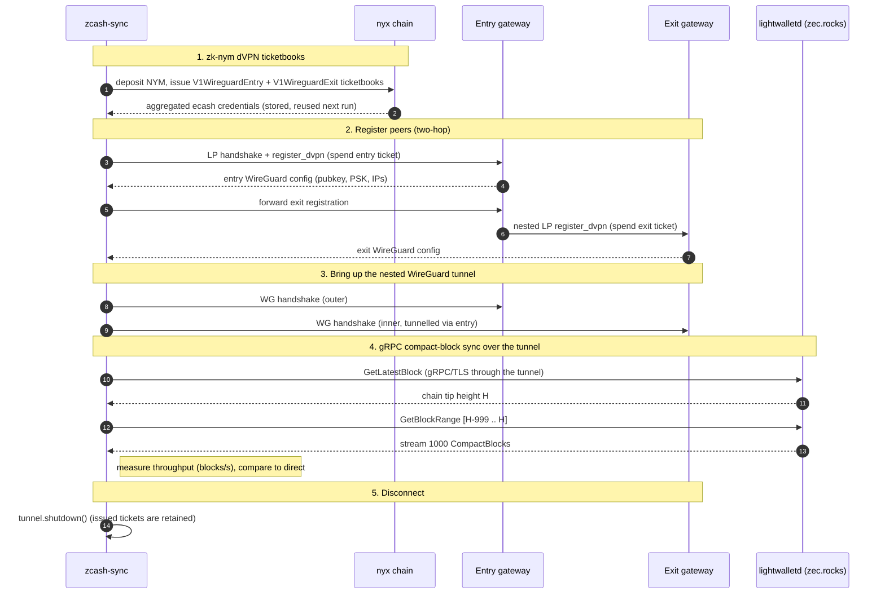

# nym-smol-dvpn

A pure-Rust, userspace **1-/2-hop WireGuard dVPN datapath** built on
[`boringtun`](https://docs.rs/boringtun) and [`smol-core`](../../../common/smol-core),
with **no OS `tun` device and no root**. Application traffic flows through the
tunnel via ordinary tokio socket surfaces (`TcpStream`, `UdpSocket`, and
`tonic`/`hyper` connectors).

## Data-plane modes

Three modes (design D5), selected on the builder:

- **one-hop** — a single `boringtun` `Tunn` to one gateway.
- **two-hop** — nested `Tunn`s: the exit tunnel's ciphertext is framed as an
  inner IP/UDP datagram (via `smoltcp::wire`) and re-encrypted by the entry
  tunnel (design D4, proven in conformance spike A).
- **QUIC-tunnelling two-hop** — the entry leg is fronted by an inline QUIC
  bridge (ALPN `hq-29`, ed25519-SPKI pinning, 2-byte length framing) for
  clients blocked from pure UDP. QUIC only ever fronts the two-hop entry leg.

## Usage

The datapath is **decoupled from provisioning**: build a `PeerConfig` per hop
(e.g. by mapping a `nym-sdk-session` registration) and hand it to a
`TunnelBuilder`.

```rust
use nym_smol_dvpn::{TunnelBuilder, PeerConfig, BridgeParams};

// Two-hop over direct UDP:
let tunnel = TunnelBuilder::two_hop(entry, exit)
    .cancellation_token(token)
    .connect()
    .await?;

let mut tcp = tunnel.tcp_connect("1.1.1.1:443".parse()?).await?;
// ... use `tcp` as any AsyncRead + AsyncWrite ...

// gRPC through the tunnel:
let channel = tonic::transport::Endpoint::from_static("http://10.0.0.1:50051")
    .connect_with_connector(tunnel.connector())
    .await?;

tunnel.shutdown().await;

// QUIC-bridged two-hop:
let tunnel = TunnelBuilder::two_hop(entry, exit)
    .quic_bridge(BridgeParams { addresses, sni_host, id_pubkey })
    .connect()
    .await?;
```

## Examples

Runnable end-to-end demos live in `examples/` (shared setup is in
`examples/common/`). **All need a funded `MNEMONIC`** and a live Nym network —
see [Developers](#developers) for pointing at sandbox.

| Example | What it does |
|---|---|
| `smol-dvpn-config` | Register a single hop and export a plain WireGuard config (`Interface` + `Peer`). Takes `--gateway <SPEC>`. |
| `smol-dvpn-topup` | Spend a stored ticket via the gateway `metadata` endpoint and report updated bandwidth. |
| `smol-dvpn-grpc` | A `tonic` gRPC health check through the tunnel. |
| `two-hop-ip` | Prove the tunnel relocates your public IP: query `ipinfo.io` directly, then through the tunnel (the IP/org/country should become the exit gateway's). |
| `two-hop-quic` | Like `two-hop-ip`, but the **entry leg is carried over a QUIC bridge** (for clients blocked from plain WireGuard/UDP). Always QUIC + two-hop. |
| `zcash-sync` | Time syncing the last N Zcash compact blocks (default 10,000, `--blocks <N>`) from a public `lightwalletd` (`zec.rocks:443`, gRPC-over-TLS) directly vs. through the tunnel, and compare throughput. |

Run one with (see [Developers](#developers) to set the sandbox env first).
**Build `--release`** — `boringtun` is much slower in debug, which dominates the
tunnel timing:

```sh
MNEMONIC="<funded mnemonic>" cargo run --release -p nym-smol-dvpn --example two-hop-ip
```

### Command-line options

`two-hop-ip`, `two-hop-quic`, and `zcash-sync` share a common option set (pass
after `--`, e.g. `cargo run … --example two-hop-ip -- --entry DE --quic`):

| Option | Meaning |
|---|---|
| `--two-hop` | Entry **and** exit gateways (the default). |
| `--one-hop` | A single gateway (entry == exit). Cannot be combined with `--quic`. |
| `--entry <SPEC>` | Entry (or, with `--one-hop`, the sole) gateway selector. Default `random`. |
| `--exit <SPEC>` | Exit gateway selector. Default `random`. Ignored in one-hop mode. |
| `--gateway <SPEC>` | Set both entry and exit at once (handy for `--one-hop`). |
| `--quic` | Require a **QUIC-bridge-capable** entry gateway and front the entry leg with it. Two-hop only. |
| `-h`, `--help` | Print the options and exit. |

`<SPEC>` selects a gateway one of three ways:

| `<SPEC>` | Selection |
|---|---|
| `random` | Any WireGuard-capable gateway (the default). |
| `<CC>` | A two-letter ISO 3166 country code, e.g. `DE`, `CH` — a random gateway in that country. |
| `<identity>` | An exact gateway ed25519 identity key (base58). |

Notes:
- `two-hop-quic` is QUIC + two-hop by definition; it still honours
  `--entry`/`--exit`/`--gateway` but ignores `--one-hop`/`--quic`.
- **QUIC only fronts the two-hop entry leg** — `--quic --one-hop` is rejected.
- QUIC-entry selection needs a **dVPN gateway-directory URL** so the session can
  discover QUIC-bridge-capable gateways and their bridge params. The examples
  default to the sandbox directory; override with `DVPN_DIRECTORY_URL`. If no
  QUIC-capable entry matches the requested country/identity, selection fails with
  `NoQuicGateway`.

Examples (`…` = `MNEMONIC="…" cargo run --release -p nym-smol-dvpn`):

```sh
# Random two-hop, show the IP relocate:
… --example two-hop-ip
# Two-hop with a German entry and a Swiss exit:
… --example two-hop-ip -- --entry DE --exit CH
# Single-hop through one specific gateway:
… --example two-hop-ip -- --one-hop --gateway <base58-identity>
# Zcash sync through a QUIC-fronted two-hop tunnel:
… --example zcash-sync -- --quic
```

### `zcash-sync` flow



## Developers

The examples read the target network from the environment
(`NymNetworkDetails::new_from_env()`). To run against **sandbox**, source the
repo's sandbox env file and provide a funded sandbox mnemonic:

```sh
# from the repo root:
set -a; source envs/sandbox.env; set +a      # nyxd / nym-api / contract addresses
export MNEMONIC="<funded sandbox mnemonic>"   # deposits NYM + issues ticketbooks

cargo run --release -p nym-smol-dvpn --example two-hop-ip
```

- Build `--release`: `boringtun`'s userspace crypto is much slower in a debug
  build, which dominates the through-tunnel timing (especially `zcash-sync`).

- `envs/sandbox.env` sets the `NYM_*`/network variables `new_from_env()` reads;
  without it the examples target mainnet.
- The mnemonic's account must hold enough sandbox NYM to deposit for the
  WireGuard ticketbooks (issued once, then reused from the per-example
  credential store, e.g. `two-hop-ip-data/`).
- `DVPN_DIRECTORY_URL` defaults to the sandbox dVPN directory (used for gateway
  monikers and QUIC-bridge discovery); override it for another network.
- `RUST_LOG=info` (or `nym_smol_dvpn=debug`) surfaces datapath/handshake logs.

## Features

- `CancellationToken` aborts setup or tears down the long-lived tunnel;
  `shutdown()` is equivalent. Issued tickets are never touched by this crate.
- Configurable, runtime-adjustable per-hop MTU via `Tunnel::set_mtu()` (rebuilds
  the smol-core interface while preserving the WireGuard session; reference
  defaults: overhead 80/hop; desktop 1420/1340; mobile 1360/1280).
- DNS-in-tunnel by default (configurable), via the `smol-core` resolver.
- Throughput-tuned stack: a 512 KiB TCP window (vs smoltcp's 8 KiB default) and
  an unbounded device burst, so bulk transfers aren't window/BDP-throttled on
  higher-RTT two-hop paths (`StackConfig::with_tcp_buffer` tunes it).
- boringtun timer pump on the datapath task; keepalive/handshake/rekey routed
  through the active transport.
- Optional `SocketProtector` callback (Linux/Android) for the egress UDP socket.

## Third-party dependencies

`boringtun` (BSD-3-Clause), `quinn` + `quinn-proto` (MIT/Apache-2.0) are declared
**crate-local** here, not promoted to the workspace dependency table (design D10).

## Tests

`cargo test -p nym-smol-dvpn` includes the QUIC bridge conformance test (framing
+ ed25519-SPKI pinning, positive and negative) against a local mock bridge.
End-to-end tunnel bring-up against a live Nym gateway is validated separately
(needs credentials + network).

## Design

See `sdk/rust/docs/nym-sdk-dvpn/` and the `dvpn-tunnel` / `dvpn-quic-bridge`
OpenSpec capabilities.
