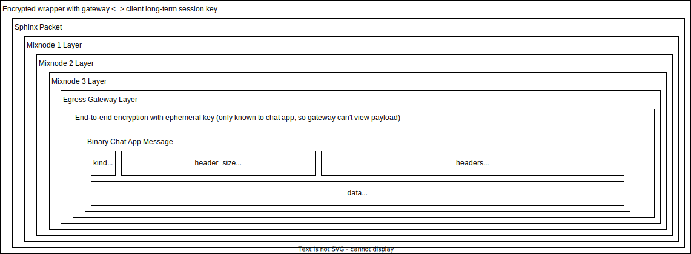

# Nym Chrome Extension Example

This is an example of how Nym can be used within the context of a Chrome extension.

## Running the example

1. Copy a build of the Nym TypeScript SDK (ESM version) into `./sdk`.
2. Navigate to `chrome://extensions` in Google Chrome.
3. Enable "Developer mode" (top right of the page).
4. Click on "Load unpacked" (top left of the page).
5. Load this extension folder.

## How does it work?

The Nym Mixnet Client runs a [Web Worker](https://developer.mozilla.org/en-US/docs/Web/API/Web_Workers_API) that wraps
a WASM library that builds and encrypts Sphinx packets in the browser to send over the Nym mixnet:

The WASM code encrypts each layer of the Sphinx packet in the browser, before sending the Sphinx packet over a websocket to the ingress gateway:

