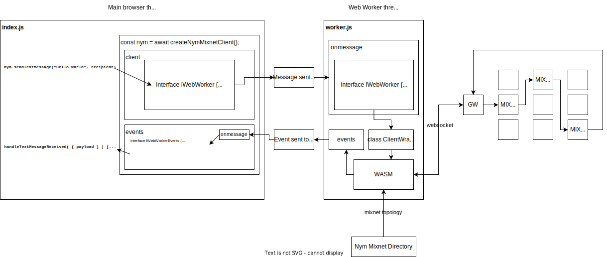
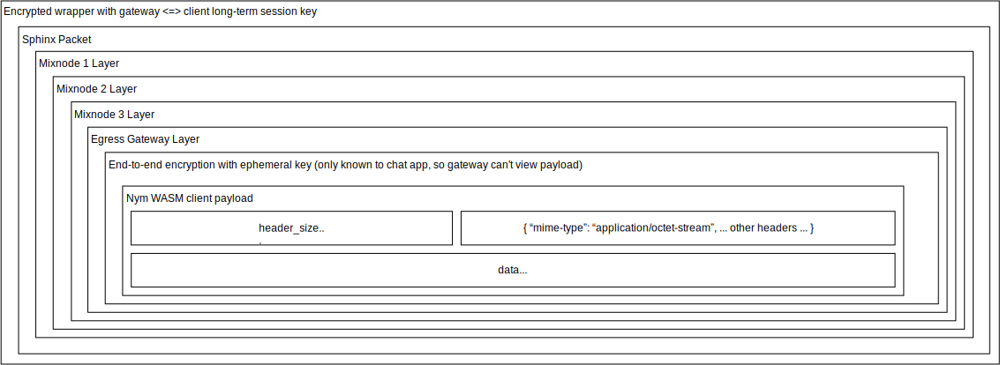

# Nym Firefox Extension Example

This is an example of how Nym can be used within the context of a Mozilla Firefox extension.

## Running the example

First, build the Nym SDK:

From the SDK directory `sdk/typescript/packages/sdk` run:

```js
npm run build:local
```

Then, from the example directory `sdk/typescript/examples/firefox-extension` run:

```js
npm install
npm run build
```

## Workers

Firefox browser extensions cannot run inline web workers. In order to overcome this limitation, the Nym Firefox Extension Example imports workers from the SDK and uses Webpack's `worker-loader` to allow the worker's to be bundled inline into the extension. In order for webpack to include the workers in the build, they are imported as modules in the `src/index.js` file:

## How does it work?

The Nym Mixnet Client runs a [Web Worker](https://developer.mozilla.org/en-US/docs/Web/API/Web_Workers_API) that wraps
a WASM library that builds and encrypts Sphinx packets in the browser to send over the Nym mixnet:



The WASM code encrypts each layer of the Sphinx packet in the browser, before sending the Sphinx packet over a websocket to the ingress gateway:


