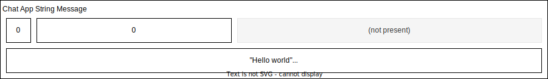
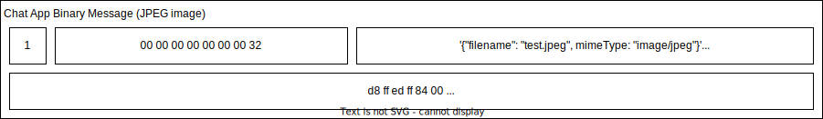

# React Nym Mixnet Chat App

This is an example of using the Nym Mixnet to send text chat messages, with optional binary file attachments.

You can use this example as a seed for a new project, and it uses:

- React
- Webpack
- WASM
- Web Workers
- Material UI (MUI)

## Before you start

You will need to have the Rust WASM toolchain installed. Please [follow the instructions here](https://rustwasm.github.io/docs/book/game-of-life/setup.html)
to install `wasm-pack` and then run the sample.

> **VERY IMPORTANT** Please note that this example will build the WASM client locally using Rust and will not use the latest published NPM package. 

## Running the example

Try out the chat app by running:

```
yarn
yarn start
```

## How does it work?

The Nym Mixnet Client runs a [Web Worker](https://developer.mozilla.org/en-US/docs/Web/API/Web_Workers_API) that wraps 
a WASM library that builds and encrypts Sphinx packets in the browser to send over the Nym mixnet:


The chat app has a custom payload that sends either string messages or binary files:


String messages are sent like this:



Files include the filename and mime-type, so that the recipient can download them with the correct name:



The WASM code encrypts each layer of the Sphinx packet in the browser, before sending the Sphinx packet over a websocket to the ingress gateway:


