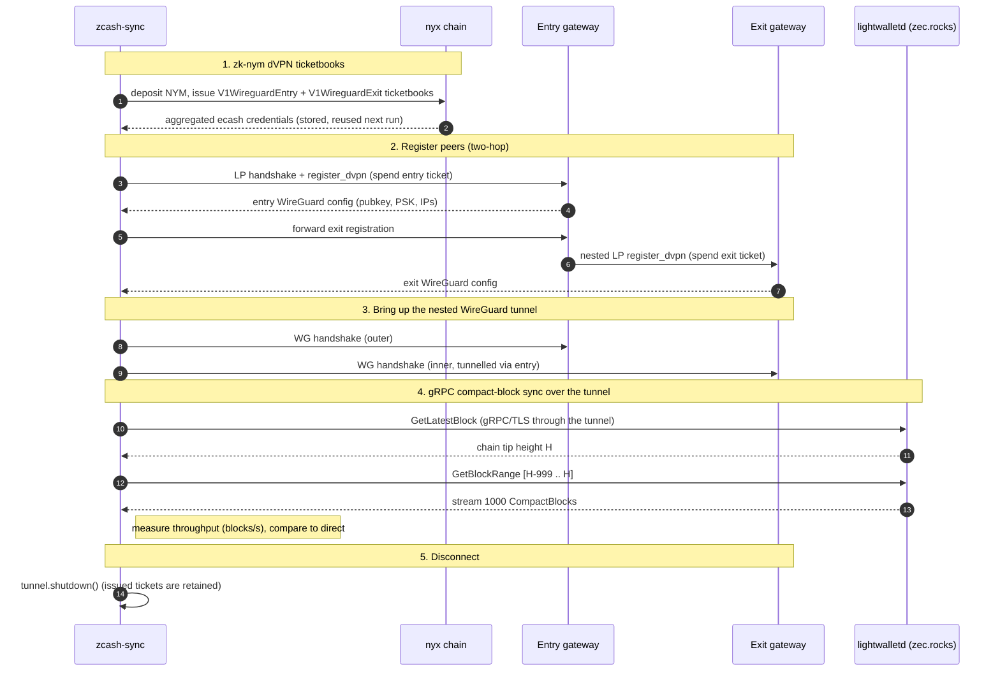

# nym-smoldvpn

A pure-Rust, userspace 1-/2-hop WireGuard dVPN datapath built on
[`boringtun`](https://docs.rs/boringtun) and [`nym-smol-core`](../common/smol-core),
with no OS `tun` device and no root. Application traffic flows through the
tunnel over ordinary tokio socket surfaces (`TcpStream`, `UdpSocket`, and
`tonic`/`hyper` connectors).

## What can I use `nym-smoldvpn` for?

Tunnel some or all of your app's internet traffic over the Nym network, in
1-hop or 2-hop dVPN mode, from Rust. You don't stand up an OS-wide VPN; the
tunnel is scoped to the sockets your app opens through it. This is not an
OS-level kill-switch: traffic your app sends over ordinary (non-tunnel)
sockets, and the host's own DNS, still go out normally and are not protected.
For the traffic you do route through it, closing the tunnel cuts that traffic
off, so it acts as a per-socket kill-switch for the flows you opted in.
Routing all of an app's traffic (and preventing leaks around it) is the
integrator's responsibility.

How it works, end to end:

1. **Get unlinkable credentials.** Your app acquires zk-nym ticketbooks to pay
   for access to the Nym network. Because they're zero-knowledge, there is no
   link between the payment and the network usage it unlocks.
2. **Register with individual gateways.** Each hop registers separately and is
   handed its own unique WireGuard identity; there is no centralised, shared
   WireGuard public key. The network is run by independent operators, so trust
   isn't concentrated in one party.
3. **Send traffic through tokio.** Drive the tunnel with ordinary async
   primitives (`AsyncRead`/`AsyncWrite`, `TcpStream`, `UdpSocket`) and layer
   crates like `tonic` or `hyper` on top to send gRPC, HTTP, or anything else
   inside your app-specific tunnel. Under the hood it is WireGuard, so
   per-packet header overhead stays small.

To get around a censor doing deep packet inspection, turn on the QUIC bridge
transport ([Data-plane modes](#data-plane-modes)): the WireGuard tunnel rides inside a QUIC
connection to a Nym network bridge, so on the wire it looks like ordinary QUIC
rather than WireGuard/UDP.

### Using the crate without your users holding NYM

Your end-users don't have to acquire or hold NYM to use the Nym network. Run
the [`nym-credential-proxy`](../nym-credential-proxy/nym-credential-proxy), an
authenticated service you operate that issues zk-nyms to your users on their
behalf. Your app authenticates to the proxy, the proxy issues the unlinkable
credentials, and your users get Nym access without handling any tokens.

## Data-plane modes

Three modes, selected on the builder:

- **one-hop**: a single `boringtun` `Tunn` to one gateway.
- **two-hop**: nested `Tunn`s. The exit tunnel's ciphertext is framed as an
  inner IP/UDP datagram (via `smoltcp::wire`) and re-encrypted by the entry
  tunnel.
- **QUIC-tunnelling two-hop**: the entry leg is fronted by an inline QUIC
  bridge (ALPN `hq-29`, ed25519-SPKI pinning, 2-byte length framing) for
  clients blocked from pure UDP. QUIC only ever fronts the two-hop entry leg.

## Usage

The datapath is decoupled from provisioning: build a `PeerConfig` per hop
(e.g. by mapping a `nym-sdk-session` registration) and hand it to a
`TunnelBuilder`.

```rust
use nym_smoldvpn::{TunnelBuilder, PeerConfig, BridgeParams};

// Two-hop over direct UDP:
let tunnel = TunnelBuilder::two_hop(entry, exit)
    .cancellation_token(token)
    .connect()
    .await?;

let mut tcp = tunnel.tcp_connect("1.1.1.1:443".parse()?).await?;
// ... use `tcp` as any AsyncRead + AsyncWrite ...

// gRPC through the tunnel:
let channel = tonic::transport::Endpoint::from_static("http://10.0.0.1:50051")
    .connect_with_connector(tunnel.connector())
    .await?;

tunnel.shutdown().await;

// QUIC-bridged two-hop:
let tunnel = TunnelBuilder::two_hop(entry, exit)
    .quic_bridge(BridgeParams { addresses, sni_host, id_pubkey_base64 })
    .connect()
    .await?;
```

## Examples

Runnable end-to-end demos live in `examples/` (shared setup is in
`examples/common/`). All need a funded `MNEMONIC` and a live Nym network; see
[Developers](#developers) for pointing at sandbox.

| Example | What it does |
|---|---|
| `smoldvpn-config` | Register a single hop and export a plain WireGuard config (`Interface` + `Peer`). Takes `--gateway <SPEC>`. |
| `smoldvpn-topup` | Spend a stored ticket via the gateway `metadata` endpoint and report updated bandwidth. |
| `smoldvpn-grpc` | A `tonic` gRPC health check through the tunnel. |
| `two-hop-ip` | Prove the tunnel relocates your public IP: query `ipinfo.io` directly, then through the tunnel (the IP/org/country should become the exit gateway's). |
| `two-hop-quic` | Like `two-hop-ip`, but the **entry leg is carried over a QUIC bridge** (for clients blocked from plain WireGuard/UDP). Always QUIC + two-hop. |
| `zcash-sync` | Time syncing the last N Zcash compact blocks (default 10,000, `--blocks <N>`) from a public `lightwalletd` (`zec.rocks:443`, gRPC-over-TLS) directly vs. through the tunnel, and compare throughput. |

Run one with (see [Developers](#developers) to set the sandbox env first).
Build `--release`: `boringtun` is much slower in debug, which dominates the
tunnel timing:

```sh
MNEMONIC="<funded mnemonic>" cargo run --release -p nym-smoldvpn --example two-hop-ip
```

### Command-line options

`two-hop-ip`, `two-hop-quic`, and `zcash-sync` share a common option set (pass
after `--`, e.g. `cargo run … --example two-hop-ip -- --entry DE --quic`):

| Option | Meaning |
|---|---|
| `--two-hop` | Entry **and** exit gateways (the default). |
| `--one-hop` | A single gateway (entry == exit). Cannot be combined with `--quic`. |
| `--entry <SPEC>` | Entry (or, with `--one-hop`, the sole) gateway selector. Default `random`. |
| `--exit <SPEC>` | Exit gateway selector. Default `random`. Ignored in one-hop mode. |
| `--gateway <SPEC>` | Set both entry and exit at once (handy for `--one-hop`). |
| `--quic` | Require a **QUIC-bridge-capable** entry gateway and front the entry leg with it. Two-hop only. |
| `-h`, `--help` | Print the options and exit. |

`<SPEC>` selects a gateway one of three ways:

| `<SPEC>` | Selection |
|---|---|
| `random` | Any WireGuard-capable gateway (the default). |
| `<CC>` | A two-letter ISO 3166 country code, e.g. `DE`, `CH`: a random gateway in that country. |
| `<identity>` | An exact gateway ed25519 identity key (base58). |

Notes:
- `two-hop-quic` is QUIC + two-hop by definition; it still honours
  `--entry`/`--exit`/`--gateway` but ignores `--one-hop`/`--quic`.
- QUIC only fronts the two-hop entry leg, so `--quic --one-hop` is rejected.
- QUIC-entry selection needs a **dVPN gateway-directory URL** so the session can
  discover QUIC-bridge-capable gateways and their bridge params. The examples
  default to the sandbox directory; override with `DVPN_DIRECTORY_URL`. If no
  QUIC-capable entry matches the requested country/identity, selection fails with
  `NoQuicGateway`.

Examples (`…` = `MNEMONIC="…" cargo run --release -p nym-smoldvpn`):

```sh
# Random two-hop, show the IP relocate:
… --example two-hop-ip
# Two-hop with a German entry and a Swiss exit:
… --example two-hop-ip -- --entry DE --exit CH
# Single-hop through one specific gateway:
… --example two-hop-ip -- --one-hop --gateway <base58-identity>
# Zcash sync through a QUIC-fronted two-hop tunnel:
… --example zcash-sync -- --quic
```

### `zcash-sync` flow



## Developers

The examples read the target network from the environment
(`NymNetworkDetails::new_from_env()`). To run against **sandbox**, source the
repo's sandbox env file and provide a funded sandbox mnemonic:

```sh
# from the repo root:
set -a; source envs/sandbox.env; set +a      # nyxd / nym-api / contract addresses
export MNEMONIC="<funded sandbox mnemonic>"   # deposits NYM + issues ticketbooks

cargo run --release -p nym-smoldvpn --example two-hop-ip
```

- Build `--release`: `boringtun`'s userspace crypto is much slower in a debug
  build, which dominates the through-tunnel timing (especially `zcash-sync`).

- `envs/sandbox.env` sets the `NYM_*`/network variables `new_from_env()` reads;
  without it the examples target mainnet.
- The mnemonic's account must hold enough sandbox NYM to deposit for the
  WireGuard ticketbooks (issued once, then reused from the per-example
  credential store under `data/<example>/<network>/`, e.g.
  `data/two-hop-ip/sandbox/`).
- `DVPN_DIRECTORY_URL` defaults to the sandbox dVPN directory (used for gateway
  monikers and QUIC-bridge discovery); override it for another network.
- Renamed to `nym-smoldvpn` (previously `smoldvpn`, and originally
  `nym-smol-dvpn`); the crate lives at the repo root. Migration for local state
  and habits: `RUST_LOG` targets are now `nym_smoldvpn=…` (was `smoldvpn=…`, and
  `nym_smol_dvpn=…` before that); the `smol-dvpn-*` examples are now
  `smoldvpn-*`, so any local `data/smol-dvpn-*` directories should be renamed to
  `data/smoldvpn-*` to keep their credentials. `zcash-sync`, `two-hop-ip`,
  `two-hop-quic` and their data directories are unaffected.
- Registration reuse: successful gateway registrations are persisted by
  `nym-sdk-session` (`registrations.json` next to `creds.db`, per network +
  gateway + role) and reused on later runs against the same gateways, spending
  zero tickets until the gateway-side allowance actually depletes. The
  examples gate bring-up on `Tunnel::await_established` (15s bound; healthy
  establishment is ~100ms) and, when a cached registration's peer is gone,
  invalidate it and register fresh automatically (`reusing cached
  registration …` / `… failed to establish; re-registering` in the logs).
- Logging: the examples emit their progress/results as `tracing` logs (on
  **stderr**) rather than `println!`, and install a subscriber so they appear out
  of the box. The default filter (when `RUST_LOG` is unset) is the running
  example plus `nym-smoldvpn` and `boringtun` at `info`. Override with
  `RUST_LOG`, e.g. `RUST_LOG=nym_smoldvpn=debug` for the full datapath/handshake
  detail, or `RUST_LOG=debug` for everything. Stdout is reserved for genuine
  output (the `smoldvpn-config` WireGuard config and `--help` text), so e.g.
  `cargo run … --example smoldvpn-config > wg0.conf` stays clean.

## Features

- `CancellationToken` aborts setup or tears down the long-lived tunnel;
  `shutdown()` is equivalent. Issued tickets are never touched by this crate.
- Configurable, runtime-adjustable per-hop MTU via `Tunnel::set_mtu()` (rebuilds
  the nym-smol-core interface while preserving the WireGuard session; reference
  defaults: overhead 80/hop; desktop 1420/1340; mobile 1360/1280).
- DNS-in-tunnel by default (configurable), via the `nym-smol-core` resolver.
- Throughput-tuned stack: a 512 KiB TCP window (vs smoltcp's 8 KiB default) and
  an unbounded device burst, so bulk transfers aren't window/BDP-throttled on
  higher-RTT two-hop paths (`StackConfig::with_tcp_buffer` tunes it).
- boringtun timer pump on the datapath task; keepalive/handshake/rekey routed
  through the active transport.
- Optional `SocketProtector` callback (Linux/Android) for the egress UDP socket.

## Third-party dependencies

`boringtun` (BSD-3-Clause), `quinn` + `quinn-proto` (MIT/Apache-2.0) are declared
**crate-local** here, not promoted to the workspace dependency table, keeping the
WG/QUIC dependency surface contained to this crate.

## Tests

`cargo test -p nym-smoldvpn` includes the QUIC bridge conformance test (framing
and ed25519-SPKI pinning, positive and negative) against a local mock bridge.
End-to-end tunnel bring-up against a live Nym gateway is validated separately
(needs credentials + network).

## Design

See the architecture docs in
[`docs/design/smoldvpn/`](../docs/design/smoldvpn/) and the
OpenSpec capability specs this crate implements:

- [`dvpn-tunnel`](../openspec/specs/dvpn-tunnel/spec.md): the userspace
  WireGuard datapath, tunnel modes, lifecycle, DNS, MTU, and top-up.
- [`dvpn-quic-bridge`](../openspec/specs/dvpn-quic-bridge/spec.md): the
  `WgPacketTransport` abstraction and the QUIC bridge transport.
- [`dvpn-tools`](../openspec/specs/dvpn-tools/spec.md): the example CLIs
  (config export, bandwidth top-up, gRPC/IP/Zcash demos).

Related capabilities in sibling crates:
[`dvpn-session`](../openspec/specs/dvpn-session/spec.md) (provisioning,
`nym-sdk-session`) and
[`smol-core-stack`](../openspec/specs/smol-core-stack/spec.md) (the
`nym-smol-core` TCP/IP stack).

## License

`nym-smoldvpn` is licensed under the **Apache License, Version 2.0**
([`Apache-2.0`](../LICENSES/Apache-2.0.txt)). Unless you explicitly state otherwise,
any contribution intentionally submitted for inclusion in this crate shall be
licensed as above, without any additional terms or conditions.

Bundled third-party crates keep their own permissive licenses: `boringtun`
(BSD-3-Clause) and `quinn` / `quinn-proto` (MIT OR Apache-2.0).
